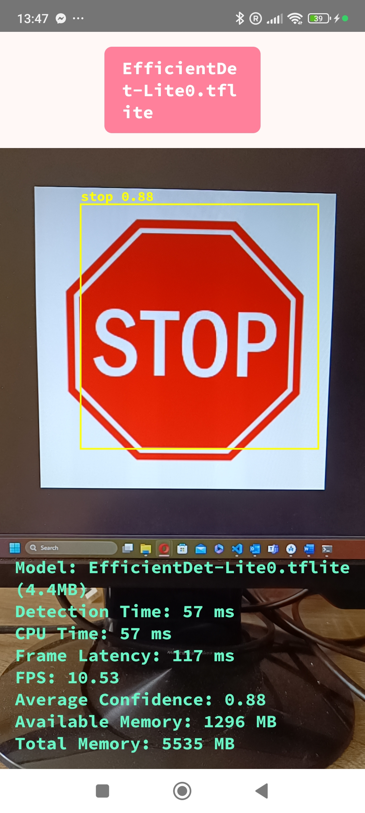
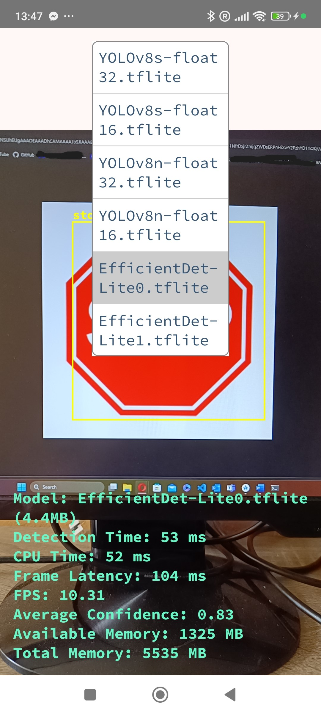
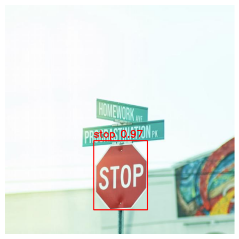
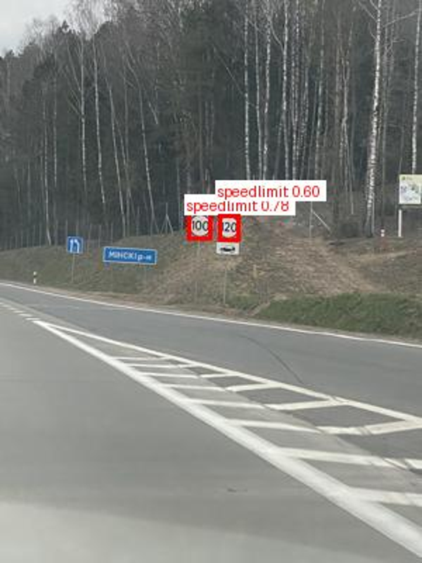

# Road Sign Detection App

## Overview

The Road Sign Detection App is designed to monitor resource usage and model performance on Android devices. This app leverages advanced object detection algorithms such as YOLOv8 and EfficientDet-Lite to provide real-time detection and classification of road signs. It helps in evaluating which model performs best in terms of accuracy, inference time, CPU usage, memory consumption, and battery usage.

## Features

- **Real-Time Detection**: Provides instant detection and classification of road signs from live camera feed.
- **Multiple Models**: Supports multiple pre-trained models, including YOLOv8 and EfficientDet-Lite.
- **Detailed Metrics**: Displays detection time, CPU usage, frame latency, frames per second (FPS), and average confidence.
- **Battery and Memory Monitoring**: Keeps track of available and total memory, as well as battery level during detection.

## Models

### YOLOv8
- **YOLOv8n**: Lightweight model with high accuracy.
- **YOLOv8s**: Slightly larger model with even higher accuracy.

### EfficientDet-Lite
- **EfficientDet-Lite0**: Optimized for faster inference.
- **EfficientDet-Lite1**: Slightly more complex, providing better accuracy at the cost of inference speed.

## Training and Evaluation

The models were trained and evaluated using the [Road Signs Dataset](https://makeml.app/datasets/road-signs), which contains 877 images of road signs in four classes: Traffic Light, Stop, Speed Limit, and Crosswalk. The dataset was preprocessed and augmented using [Roboflow](https://roboflow.com).

### Training Details

- **YOLOv8 Models**: Trained using the Ultralytics YOLOv8 framework.
  - [YOLOv8 Training Notebook](https://colab.research.google.com/drive/1tnxdMDlnv-Z1Zd6O5ikOV5n2d3ps9eus?usp=sharing)

- **EfficientDet-Lite Models**: Trained using TensorFlow Lite Model Maker.
  - [EfficientDet-Lite Training Notebook](https://colab.research.google.com/drive/1SKUNCGkUPdTBRm_S7ptD8BpXR74bWBzh?usp=sharing)

### Evaluation Results

| Model               | mAP  | Average Inference Time  |
|---------------------|------|-------------------------|
| EfficientDet-Lite0  | 0.638| 1.918 s                 |
| EfficientDet-Lite1  | 0.623| 6.269 s                 |
| YOLOv8n             | 0.911| 9.2 ms                  |
| YOLOv8s             | 0.918| 22 ms                   |

### Example Images

#### App Interface

Example of the app detecting road signs in real-time:

#### Model Predictions from Colab

Results from the YOLOv8n model:

Results from the EfficientDet-Lite0 model:

Results from the EfficientDet-Lite1 model:

## How to Use

1. **Launch the App**: Open the app and grant camera permissions.
2. **Select Model**: Choose the desired model from the dropdown list.
3. **Start Detection**: Begin real-time detection by pointing your camera at road signs (crosswalk sign, stop sign, traffic light, speed limit).
4. **View Results**: Observe the detection results along with performance metrics on the screen.
5. **DATA**: Get the data from the csv file. It will be generated in the emulated storage on your android device. Path : `/storage/emulated/0/Android/data/package.name
/files`.
*(Aditional resources usage data: Profiler and AGI.)*

## How to Install the Road Sign Detection App

1. **Download the APK**:
   - [Download the app](https://unilj-my.sharepoint.com/:u:/g/personal/eu2694_student_uni-lj_si/EcJoQAxUH5hLjlaOl9c4yZwBv6MybmCWUYytClPMQoc-Rw?e=1cCayO) from OneDrive.

2. **Enable Installation from Unknown Sources**:
   - Go to `Settings` > `Security`.
   - Enable `Install unknown apps` or `Unknown sources`.
   - If you are using Android 8.0 or higher, you may need to grant this permission to the app from which you are installing the APK.

3. **Install the APK**:
   - Open the downloaded APK file.
   - Follow the on-screen instructions to complete the installation.

4. **Open the App**:
   - Once installed, open the app.
  

## Acknowledgements

- [Roboflow](https://roboflow.com) 
- [Ultralytics](https://ultralytics.com) 
- [Google Colab](https://colab.research.google.com)
- [TFLite](https://www.tensorflow.org/lite/android)
